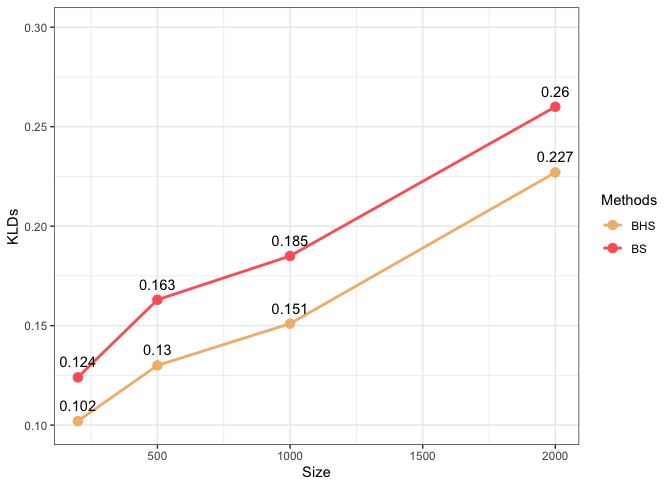
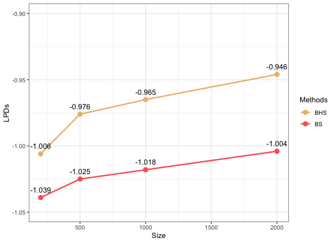

# General

This folder provides more detailed results for the comparison betweeen Bayesian Stacking (BS) and Bayesian Hierarchical Stacking (BHS).

## Model Weights using BS and BHS
### 1. n = 200

| Models |    BS    |    BHS    |
| :---   |    ---:  |    ---:   |
|Model 1 |.144295229|.18897531  |
|Model 2 |.822809549|.68925393  |  
|Model 3 |.026317523|.08170830  |
|Model 4 |.006577699|.04006246  |

### 2. n = 500

| Models |    BS     |    BHS    |
| :---   |    ---:   |    ---:   |
|Model 1 |.1656718277|.23151657  |
|Model 2 |.8256013275|.65866525  |  
|Model 3 |.0079406623|.06331364  |
|Model 4 |.0007861826|.04650454  |

### 3. n = 1000

| Models |    BS    |    BHS    |
| :---   |    ---:  |    ---:   |
|Model 1 |.20719231 |.23934164  |
|Model 2 |.72662164 |.61564034  |  
|Model 3 |.04685432 |.09482026  |
|Model 4 |.01933174 |.05019776  |

### 4. n = 2000

| Models |    BS    |    BHS    |
| :---   |    ---:  |    ---:   |
|Model 1 |.163604291|.22331033  |
|Model 2 |.818140807|.66214547  |  
|Model 3 |.010622695|.06954717  |
|Model 4 |.007632207|.04499703  |

## KLDs and LPDs across sample sizes (n = 200, 500, 1000 and 2000)

